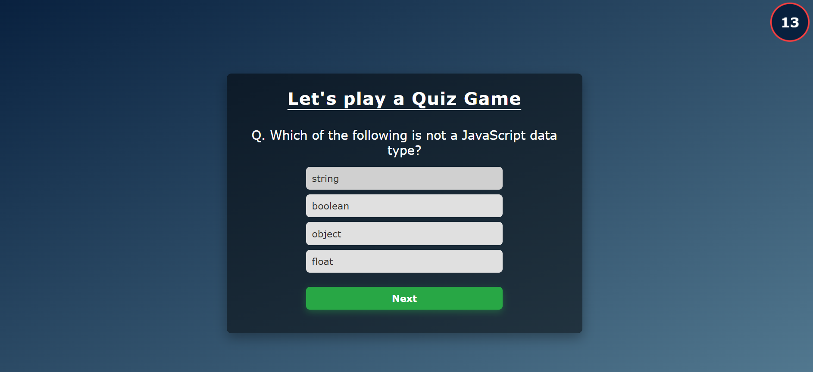
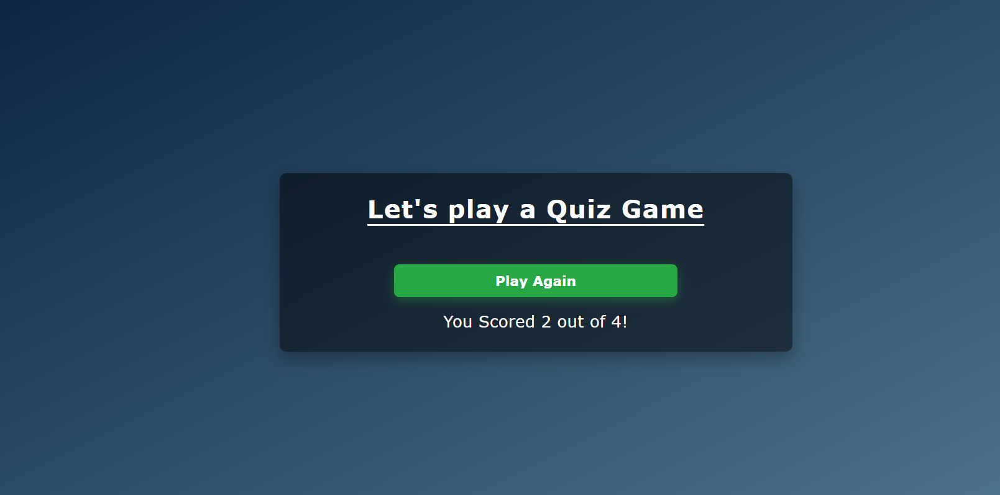

# Quiz App

A simple and interactive quiz application built using **HTML**, **CSS**, and **JavaScript**. The app features a clean layout, engaging quiz questions, and a countdown timer of 15 seconds for each question.

## Features

- **Dynamic Timer:** Each question comes with a 15-second countdown, adding a sense of urgency and fun.
- **Interactive UI:** User-friendly interface with a polished and minimalistic design.
- **Score Tracking:** Keeps track of the user's score and displays it at the end of the quiz.
- **Responsive Design:** Optimized for various screen sizes to ensure a seamless experience across devices.

## Technologies Used

- **HTML**: For structuring the content of the application.
- **CSS**: For styling the layout and enhancing visual appeal.
- **JavaScript**: For quiz functionality, timer logic, and interactivity.

## How It Works

1. Start the quiz by clicking the "Start" button.
2. A question will appear with multiple-choice answers.
3. Select the correct answer before the timer (15 seconds) runs out.
4. The app will indicate if the selected answer is correct or incorrect.
5. At the end of the quiz, your total score will be displayed.

## Project Structure

```
quiz-app/
├── index.html      # Main HTML file
├── styles.css      # Styling for the quiz layout
├── script.js       # JavaScript for quiz functionality
└── README.md       # Project documentation (this file)
```

## Getting Started

Follow these steps to set up and run the project locally:

1. Clone the repository:

   ```bash
   git clone https://github.com/yourusername/quiz-app.git
   ```

2. Navigate to the project directory:

   ```bash
   cd quiz-app
   ```

3. Open `index.html` in your browser:

   ```bash
   open index.html
   ```

## Screenshots

### Quiz Start View


### Quiz Question Example


### Final Score View



## Future Enhancements

- Add more question categories.
- Implement a leaderboard to track high scores.
- Provide a retry option after completing the quiz.
- Enhance the timer with animations.


Happy Quizzing! 🎉
